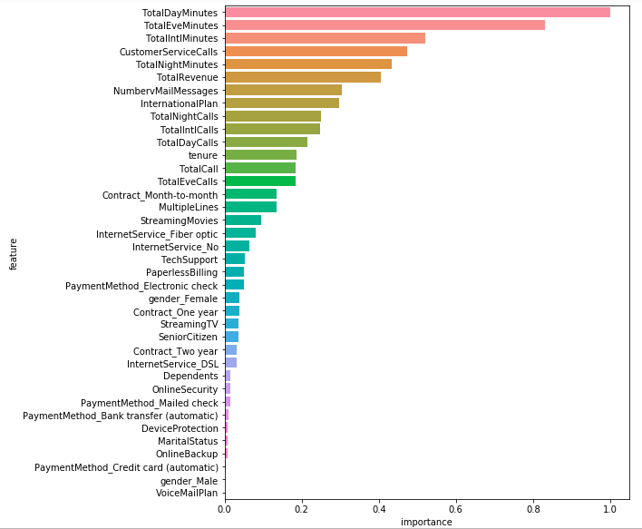

# Telecommunication Churn Prediction

In this project, we use supervised learning models to identify customers who are likely to stop using telecommunication service in the future. Furthermore, we will analyze top factors that influence user retention from model itself. The dataset source can be found in [Kaggle](https://www.kaggle.com/pangkw/telco-churn/home).

 .

## Background

Churn prediction has been a classical problem in machine learning applications. We can learn that machine learning can be linked to business goal and help human beings in data-driven decision making. And the learning here can be transferable to any subscription problems beyond telecommunication field.

## Method

After scrutinizing the dataset, this is a binary classification problem with imbalanced labels (Churned << Not churned). Features contain three major types: numeric, binary and text data. We can perform simple data cleaning and one-hot encoding to obtain a feature matrix. We will evaluate few typical models to understand the baseline predictability of this task and try to understand the hint behind modeling.

## Model Performance

Performance across various model is summarized below. The eXtreme Gradient Boosting (XGBOOST)  obviously outperform others in every aspect. Further optimization on the hyper-parameter tuning can bring us about 1% in accuracy and more one other metrics.

| Model Name                  | CV Accuracy | Precision | Recall | F1 score |
| --------------------------- | ----------- | --------- | ------ | -------- |
| Logistic regression with L1 | 0.893       | 0.691     | 0.476  | 0.564    |
| Logistic regression with L2 | 0.893       | 0.686     | 0.484  | 0.570    |
| Random forest               | 0.913       | 0.854     | 0.484  | 0.618    |
| KNN                         | 0.893       | 0.757     | 0.387  | 0.512    |
| SVM                         | 0.916       | 0.837     | 0.530  | 0.649    |
| XGBOOST                     | 0.947       | 0.885     | 0.735  | 0.803    |
| XGBOOST optimized           | 0.956       | 0.933     | 0.752  | 0.833    |

## What else does a predictive model tell us?

From the business point of view, what is more critical is that the top factors we can extract from our trained model? Most models can provide sort of internal metrics to represent the importance of each features. The more important a feature is, the more correlation this feature has to customer's churn decision (positive or negative correlation). 

Below we list all features by their feature importance from XGBOOST model. Let's focus on the top five predictive features: TotalDayMinutes, TotalEveMinutes, TotalIntlMinutes, CustomerServiceCalls and TotalNightMinutes. It is clear that four out of five are related to the call usage. We can infer that heavy service users may tend to look for better deal plans from competitors. The company may provide a better package to those targeted users from our prediction in order to reduce churn rate. From 

From CustomerServiceCalls feature, we notice that when a user make more than four service calls, they tend to be churned. This may be related to the customer service quality and trouble-shooting capability. It's also suggested that the company can collect some survey on the customer service quality and feedback.

